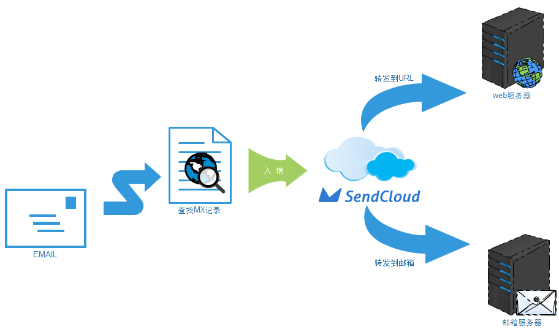
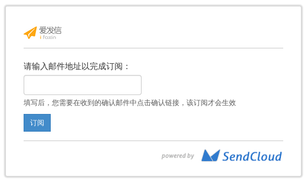

## 高级功能
    
- - -
    
### 邮件追踪 (track)

邮件追踪能够帮助用户收集已发出邮件的「打开数据」,「点击数据」,「退订数据」, 以此来评估邮件发送的效果.

你可以通过`【设置】-【追踪选项】`来配置某个「API_USER」的「打开追踪」,「点击追踪」,「订阅追踪」.

注意: 「点击追踪」依赖于用户发信域名的[CNAME 配置](#jump_cname)
    
- - -
    
### 地址列表

地址列表是一个方便用户发送邮件的功能. 用户编辑/导入地址列表后, 在请求接口时, 不需要再传输邮件地址, 只需在参数中指定地址列表的「别称地址」即可.

用户可以通过`【发送相关】-【地址列表】`来创建【地址列表】

注意: 

1. 只有通过 WEBAPI 的方式发送邮件, 才支持使用地址列表
2. 只有使用 「批量类型」的 API_USER 调用接口, 才支持使用地址列表
3. 只有付费用户才支持使用地址列表
      
- - -
    
### 邮件模板 (template)

邮件模板是另一个方便用户发送邮件的功能. 用户编辑/上传邮件模板后, 在请求接口时, 不需要再传输邮件内容, 只需在参数中指定模板的「调用名称」即可.

模板中可以定义「变量」, 变量的使用方法:

* 编辑模板时, 使用「变量」来占位邮件的部分内容
* 请求接口时, 在参数中指定「变量的值」. SendCloud 会用「变量的值」替换「变量」.

用户可以通过`【发送相关】-【邮件模板】`来创建【邮件模板】
     
- - -
    
### 标签 (tag)

标签能够帮助用户对邮件进行分类, 适用于 A/B 测试等场景.

>     给2种风格的邮件赋予不同的标签进行测试发送, 通过标签分别查看2种风格邮件的打开/点击数据
>     就能知道接收者最喜欢哪种邮件了~

注意: 每封邮件只能使用一个标签
    
- - 
     
### 收信路由 

如果你能收到你的用户的回信, 那真是一件让人激动的事情, 所以, SendCloud 为你准备了这个贴心的功能.

此功能就是把用户回复到某地址的邮件转发给你设置的邮箱, 或是你设置的某个URL. 你可以接收邮件数据, 再做后续处理.

当然, 直接发给这个地址的邮件也会被转发.


     
- - -
    
### WebHook

一封邮件发送之后, 会产生各种各样的事件和状态.     
    
例如: 被ESP弹回, 或者发送成功了, 用户打开了邮件, 点击了链接, 或者很不幸的,用户退订了你的邮件, 甚至举报了您的邮件. 如果你需要捕获此类事件进行相应的处理, WebHook提供了相应的技术支持. 当某个事件发生时, 就会触发 SendCloud 向客户设置的 URL 用 `POST` 方式发送数据, 客户收到数据, 解析出事件和数据, 做后续的处理. 
       
目前 SendCloud 支持的邮件事件如下:
     
|事件                 |触发条件         |
|:--------------------|:--------------- |
|请求(request)        |邮件请求成功     |
|发送(deliver)        |邮件发送成功     |
|打开(open)           |用户打开邮件     |
|点击(click)          |用户点击链接     |
|退订(unsubscribe)    |用户退订邮件     |
|退信(bounce)         |邮件被拒绝       |
|邮件举报(report_spam)|用户举报邮件     |
|无效邮件(invalid)    |邮件被判定无效   |

当然, 在使用之前, 你必须先在 SendCloud 的 `【设置】-【WebHook】` 中选择关注的事件, 配置接收数据的URL.

**推送数据示例**
```
labelId: 0
token: xZars0SdwK8T720SFy7ijiSDYo1rRYsP5znyfYYPbOi8apO87L
emailId: 1426140442451_27372_23704_5375.sc-10_10_127_28-inbound0$123@qq.com
signature: eccaf5621f9b798fbaec79577d1e7d055224832a6b3e5c93caa0db8cc4485c85
recipient: 123@qq.com
timestamp: 1426140444559
category: test20141102
mail_list_task_id:
event: deliver
message: Successfully delivered
```
    
`提示:`  为了确保消息的来源身份是 SendCloud,  你可以进行签名验证以获得更高的安全认证, 这是一个可选项, 不强制用户进行验证.安全认证的方法如下:
    
* 前台`【设置】-【WebHook】`为每个客户提供了APP KEY
* SendCloud推送的数据中含有参数 token, timestamp 和 signature
* 用APP KEY, token 和 timestamp 使用 [HMAC 算法](http://baike.baidu.com/link?url=4eD963Bw1nM61ZiRkXBNXAWTeIMKHwQULuNDQOR8tweyrR6V7Yk7E-f-UowA-21OOSsaaq2zJ8j1Yngeh6c2EK)生成签名, 与 signature 进行比较.
     
签名验证代码示例和事件推送参数说明参见[WebHook详细说明](../email/webhook.md)     
    
- - - 
   
###订阅入口

订阅入口的作用是帮助用户创建, 维护和用户的订阅关系.
SendCloud 和 ESP 都在推进建立用户和用户订阅关系, 也会大力支持这种存在订阅关系的邮件发送 ( 比如 QQ邮件列表 ).
    
1. SendCloud 为用户生成一个「订阅入口」:

    
2. 用户将此入口放置在自己的网站中
    
3. 用户在「订阅入口」输入邮箱地址, 点击申请订阅此网站的文章.
    
4. 用户的邮箱地址自动加入用户的某个「地址列表」.
    
5. 用户收到确认邮件, 确认订阅操作.
    
6. 这样, 用户就完成了和用户的订阅关系.    
    
此功能依赖于「地址列表」, 用户点击某个「地址列表」的「订阅样式」, 就可以进入配置页面.
    
- - -

###取消订阅样式
    
在开启订阅追踪后，系统会在邮件中默认自动加上“取消订阅”的退订链接，供邮件接收者在不愿意接受邮件的情况下，退订此类邮件。
系统默认的取消订阅样式如下:


如需要自定义退订样式，勾选订阅追踪后，在href中插入我们提供的字符( %%user_defined_unsubscribe_link%%)，我们会自动替换为退订链接，样式可根据需要自行添加。

示例如下：
```
<a href="%%user_defined_unsubscribe_link%%">取消订阅</a>
```
