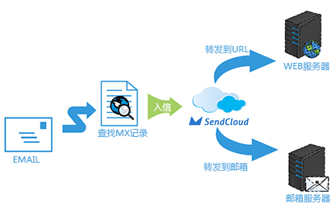

## 邮件追踪 (track)

邮件追踪能够帮助用户收集已发出邮件的「打开数据」,「点击数据」,「退订数据」, 以此来评估邮件发送的效果.

你可以通过`【设置】-【追踪选项】`来配置某个「API_USER」的「打开追踪」,「点击追踪」,「订阅追踪」.

注意: 「点击追踪」依赖于用户发信域名的[CNAME 配置](../guide/base/#jump_cname)
    
- - -
    
## 邮件模板 (template)

邮件模板是一个方便用户发送邮件的功能. 用户编辑/上传邮件模板后, 在请求接口时, 不需要再传输邮件内容, 只需在参数中指定模板的「调用名称」即可.

模板中可以定义「变量」, 变量的使用方法:

* 编辑模板时, 使用「变量」来占位邮件的部分内容
* 请求接口时, 在参数中指定「变量的值」. SendCloud 会用「变量的值」替换「变量」.

用户可以通过`【发送相关】-【邮件模板】`来创建【邮件模板】

- - -
    
## 地址列表

地址列表是一个方便用户发送邮件的功能. 用户编辑/导入地址列表后, 在请求接口时, 不需要再传输邮件地址, 只需在参数中指定地址列表的「别称地址」即可.

地址列表中可以设置「变量的值」, 用于替换「邮件内容」中的「变量」.

用户可以通过`【发送相关】-【地址列表】`来创建【地址列表】.

注意: 

1. 只有通过 WEBAPI 的方式发送邮件, 才支持使用地址列表. SMTP 接入方式暂不支持.
2. 只有使用 「批量类型」的 API_USER 调用接口, 才支持使用地址列表
3. 只有付费用户才支持使用地址列表
     
- - -
    
## 标签 (label)

标签能够帮助用户对邮件进行分类, 适用于 A/B 测试等场景.

> 给2种风格的邮件赋予不同的标签进行测试发送, 通过标签分别查看2种风格邮件的打开/点击数据
> 就能知道接收者最喜欢哪种邮件了~

注意: 每封邮件只能使用一个标签

- - -
    
## 收信路由 

如果你能收到你的用户的回信, 那真是一件让人激动的事情, 所以, SendCloud 为你准备了这个贴心的功能.

此功能就是把用户回复到某地址的邮件转发给你设置的邮箱, 或是你设置的某个URL. 你可以接收邮件数据, 再做后续处理.

当然, 直接发给这个地址的邮件也会被转发.



用户可以通过某个域名配置里面的`【收信配置】-【收信路由】`来创建收信路由.
     
- - -
    
## WebHook

请求发送给 SendCloud 之后, SendCloud 会把「请求结果」同步返回给用户, 而邮件的「发送结果」是通过 WebHook 异步返回给用户的.

WebHook 机制:

* SendCloud 为客户提供了一些邮件事件, 客户可以选择关注某些事件
* 当某事件发生, 就会触发 SendCloud 向客户设置的 URL 发送数据 ( POST )
* 客户收到数据, 解析出事件和数据, 做后续的处理
       
目前 SendCloud 支持的邮件事件如下:
     
|事件                 |触发条件         |
|:--------------------|:--------------- |
|请求(request)        |邮件请求成功     |
|发送(deliver)        |邮件发送成功     |
|打开(open)           |用户打开邮件     |
|点击(click)          |用户点击链接     |
|取消订阅(unsubscribe)|用户取消订阅邮件 |
|软退信(bounce)       |邮件被 ESP 接收之后, 又被退回|
|举报(report_spam)    |用户举报邮件     |
|无效邮件(invalid)    |邮件未发送成功   |

在使用之前, 你需要在 SendCloud 的 `【设置】-【WebHook】` 中选择关注的事件, 配置接收数据的URL.

WebHook 详细说明参见[WebHook详细](../email/webhook.md)     
    
- - - 
   
## 订阅入口

订阅入口的作用是帮助用户创建, 维护和用户的订阅关系.
SendCloud 和 ESP 都在推进建立用户和用户订阅关系, 也会大力支持这种存在订阅关系的邮件发送 ( 比如 QQ邮件列表 ).
    
1. SendCloud 为用户生成一个「订阅入口」:

    
2. 用户将此入口放置在自己的网站中
    
3. 用户在「订阅入口」输入邮箱地址, 点击申请订阅此网站的文章.
    
4. 用户的邮箱地址自动加入用户的某个「地址列表」.
    
5. 用户收到确认邮件, 确认订阅操作.
    
6. 这样, 用户就完成了和用户的订阅关系.    
    
此功能依赖于「地址列表」, 用户点击某个「地址列表」的「订阅样式」, 就可以进入配置页面.
    
- - -

## 取消订阅样式
    
在开启「订阅追踪」后, 系统会在邮件中默认自动加上 **取消订阅** 的退订链接, 供收件人退订此类邮件.

下面是系统默认的取消订阅样式:


你可以自行定义取消订阅的样式, 只要在 href 中插入 SendCloud 内部变量 `%%user_defined_unsubscribe_link%%` 即可. 示例如下：

**使用默认的取消订阅样式, 邮件无需特别处理, 内容如下:**
```
<p>亲爱的%name%:</p>
<p style="margin-bottom: 35px">您好! 您本月在爱发信的消费金额为: %money% 元.</p>
```
邮件内容效果截图如下:


- - -

**使用自定义的取消订阅样式, 邮件内容如下:**
```
<p>亲爱的%name%:</p>
<p style="margin-bottom: 35px">您好! 您本月在爱发信的消费金额为: %money% 元.</p>
<p><a style="background: #1ABC9C;border:1px solid #13A386;padding:8px 20px;color: #fff;text-decoration:none;border-radius:4px" href="%%user_defined_unsubscribe_link%%">不想再收到此类邮件</a></p>
```
邮件内容效果截图如下:


